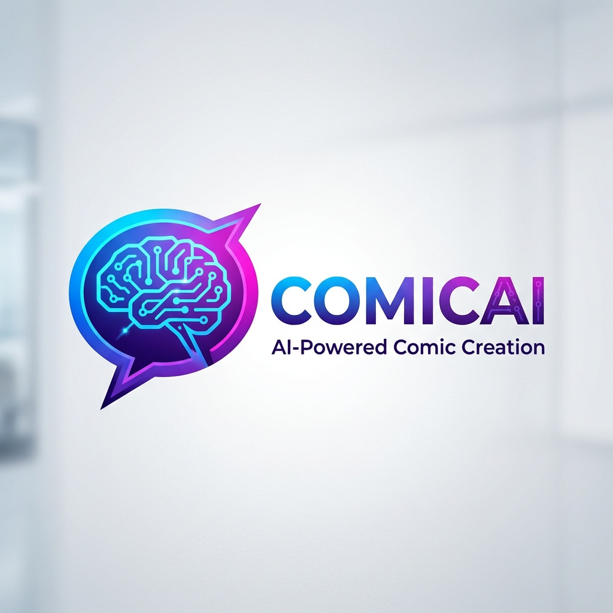

<p align="center">
  
</p>

<h1 align="center">ComicAI</h1>

<p align="center">
  <strong>Transform your ideas into captivating comic strips with the power of Artificial Intelligence.</strong>
</p>

<p align="center">
  
  
  
  
</p>

---

## 🚀 Overview

ComicAI is an innovative PHP-based web application designed to democratize comic creation. By leveraging cutting-edge AI models, it allows users to generate complete comic pages—including storylines, character dialogues, and multi-panel illustrations—from simple text prompts. Whether you're a storyteller, an educator, or just a comic enthusiast, ComicAI brings your imagination to life.

## ✨ Key Features

- **🧠 AI Script Generation**: Automatically transforms short ideas into detailed multi-panel comic scripts using Gemini 2.5 Flash.
- **🎨 Artistic Diversity**: Generates high-quality comic-style images with embedded dialogues and consistent themes.
- **🖼️ Multi-Panel Layouts**: Supports custom panel counts and dynamic layouts for professional-looking comic pages.
- **🛠️ Prompt Enhancement**: Features a "Writer's Assistant" that refines simple user inputs into rich, descriptive prompts for better visual results.
- **📁 Gallery & Management**: A personal workspace to view, download, or manage your generated comic history.
- **🌓 Modern UI**: Sleek, responsive design with full support for Light and Dark modes.

## 🛠️ Technology Stack

- **Backend**: PHP 7.4+ (Custom MVC Framework)
- **Database**: MySQL
- **AI Core**: Google Gemini 2.5 Flash & Gemini 2.5 Flash Image
- **Frontend**: Vanilla JS, Modern CSS (Glassmorphism, Flex/Grid)
- **Icons & Fonts**: Google Fonts (Plus Jakarta Sans), Material Symbols

## 🏁 Getting Started

### Prerequisites

- PHP 7.4 or higher
- MySQL Server
- A Gemini API Key from [Google AI Studio](https://aistudio.google.com/)

### Installation

1. **Clone the repository**:
   ```bash
   git clone https://github.com/your-username/comic_ai.git
   cd comic_ai
   ```

2. **Configure Environment Variables**:
   Create a `.env` file in the root directory and add your credentials:
   ```env
   DB_HOST=127.0.0.1
   DB_NAME=comic_ai
   DB_USER=your_user
   DB_PASS=your_password
   GEMINI_API_KEY=your_gemini_api_key
   APP_ENV=local
   BASE_URL=http://localhost:8000
   ```

3. **Initialize Database**:
   Import the schema into your MySQL database:
   ```bash
   mysql -u your_user -p comic_ai < db_schema.sql
   ```

4. **Launch the Application**:
   You can use the built-in PHP server for local development:
   ```bash
   php -S localhost:8000 -t public
   ```

> [!IMPORTANT]
> Ensure the `public/uploads` directory exists and is writable by the web server to allow AI-generated images to be saved.

## 📁 Project Structure

```text
├── app/              # Core Application Logic (MVC)
│   ├── Controllers/  # Route Handlers
│   ├── Core/         # Framework Core (Router, Env, Database)
│   ├── Models/       # Database Entities
│   └── Services/     # AI Provider Integration (Gemini)
├── config/           # Configuration Files
├── public/           # Entry point & Assets
├── views/            # UI Templates
└── docs/             # Documentation & Assets
```

## 👥 The Team

| Name | Role | Responsibility |
| :--- | :--- | :--- |
| **Muhammad Saad** | Backend Lead | API Integration, Core Logic, Prompt Processing |
| **Talha Ayyaz** | Frontend & UX | UI/UX Design, Comic Display, Interactive Components |
| **Shayan Mirza** | DB & Enhancement | Schema Design, Data Management, PDF Export Features |

---

<p align="center">
  Built with ❤️ for the world of digital storytelling.
</p>
